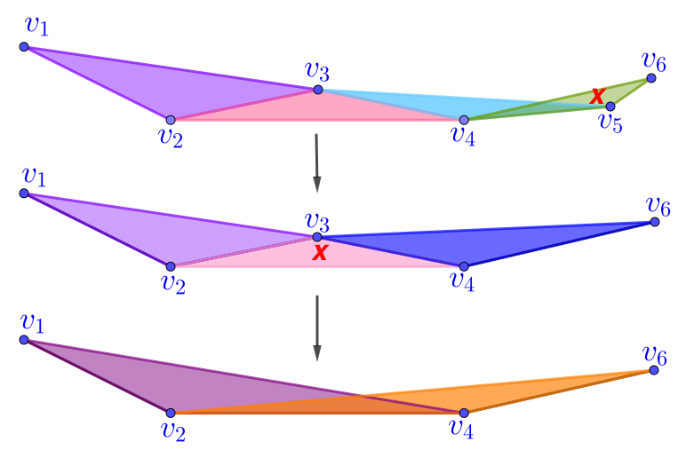
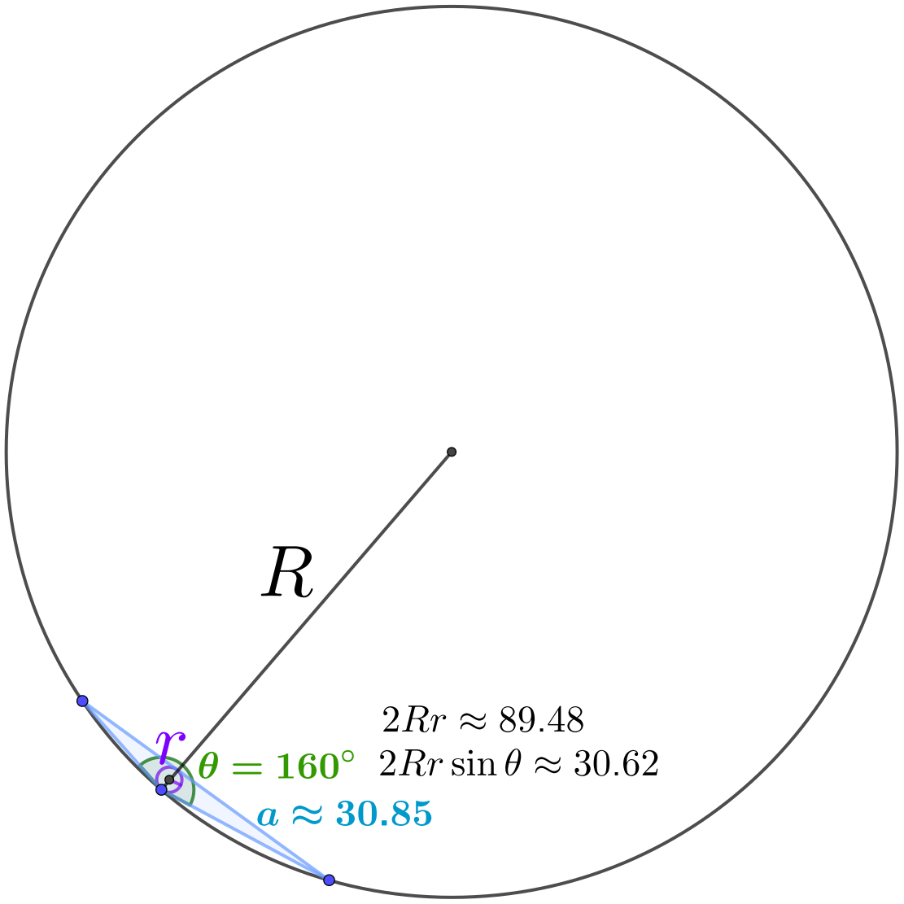
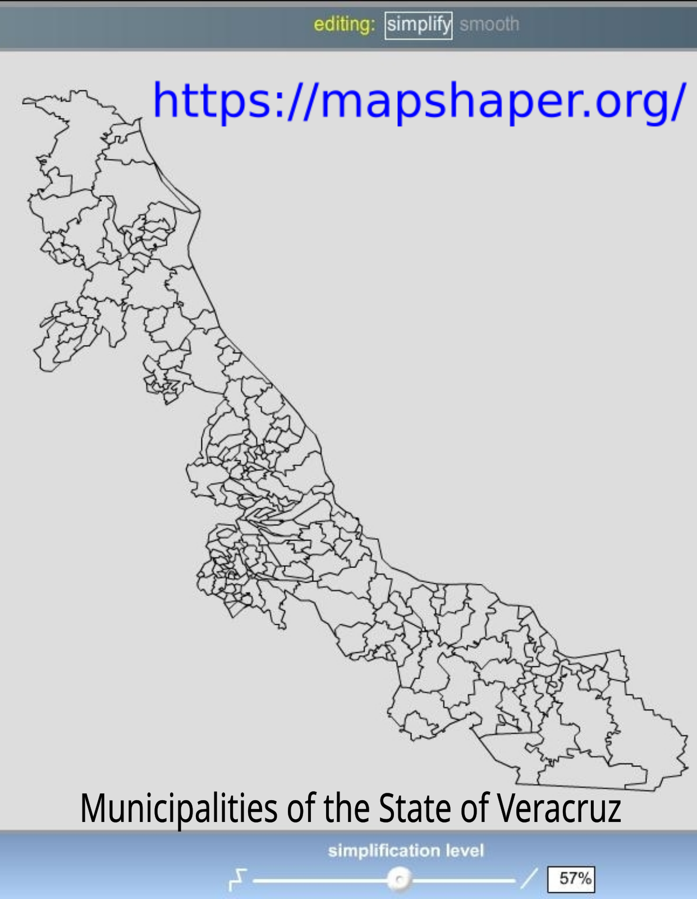
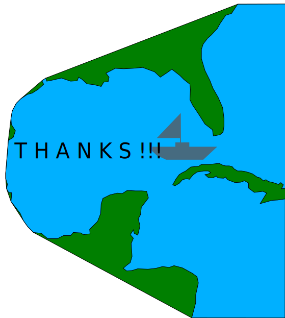

<!-- _class: lead -->

### **EditBoundary.jl - A Quest to Revive Structured Quad Meshes**

by

##### Miguel Raz Guzmán Macedo

##### Pablo Barrera Sánchez

##### Iván Méndez Cruz

#### UNAM

## **JuliaCon 2024 Eindhoven, Netherlands** 

---

### **Outline**

- **Introduction** 
- **Line Simplification**
- **Noise Detection and Reduction**
- **Method for Polygonal Approximation**
- **Conclusions and Future Work**

---
<!-- _class: lead -->

### **Introduction**
- Motivation
- Problem Statement
- The module EditBoundary.jl
- Contributions

---

<!-- Scoped style -->

### **Motivation:** Initial Step for Mesh Generation

<iframe
    width="1100"
    height="550"
    src="/home/mrg/oss/presentacion_enc2023_9sep/images/honda_lagoon.html"
></iframe>

---

<!-- Scoped style -->

### **Motivation:** Applications for Map Generalization

<iframe
    width="1000"
    height="500"
    src="http://gaia.inegi.org.mx"
></iframe>

---

<!-- Scoped style -->

### **Problem Statement**

Approximate a polygonal contour by a shape preserving polygon with fewer points.

The initial contour may have high level of detail, noise or several holes.

The approximation  preserves dominant points or encloses approximately the same area.

<iframe
    width="600"
    height="550"
    src="./images/amistad_simp_radius.html"
></iframe>

---

<!-- Scoped style -->

<!-- _class: lead -->

###  **Edit Boundary.jl**

- A module for polygonal approximation of 2D contours
- Coded in  **Julia** [[1],[3]](./slides_enc2023.html#23)
- Part of the mesher UNAMalla 6
- See Demo in action!
    
    Simplify the contour of the water dam *La Amistad* in the State of Coahuila.

---

<!-- Scoped style -->

<!-- _class: lead -->

**Older versions of EditBoundary** [[2],[6],[8]](./slides_enc2023.html#23)

- Matlab (2012) 
- UNAMalla 5 (2014)

**Issues in preserving the shape of contours with high level of detail** such as the water dam *La Amistad*. 

**Before:**
- Simplification based on Pavlidi's collinearity test [[5]](./slides_enc2023.html#23) and Ray's dominant point detection [[7]](./slides_enc2023.html#23) 
- Smoothing by conic and tension splines

**After:**
- Simplification based on triangles measures
- Smoothing by constrained minimization of the perimeter

**New Contributions:**

- Radius Method for Simplification 
- Test for Noise Detection

---
<!-- _class: lead -->

### **Line Simplification**

- Simplification of polygons
- Area method
- Radius method

---

<!-- Scoped style -->

### **Simplification of Polygons**

Given a polygon $P$ and a tolerance, 
find the polygon $P'$ with the fewest vertices such that
- $\text{vertices}({\color{red}P'}) \subset \text{vertices}({\color{blue}P})$
- $\text{score}({\color{red}P'}) \leq  \text{tolerance}$
   
   E.g. $\quad\text{score}({\color{red}P'}) = 
    \frac{| \text{area}({\color{red}P'}) - 
    \text{area}({\color{blue}P})|}
    {\text{area}({\color{blue}P})}$

$\begin{array}{|r|r|}
 \hline 
 \textbf{Simplification} & \textbf{Score}\times 10^{3} \\
 \hline 
  19.5 \% & 2.37\times 10^{-3} \\
 \hline 
  46.8 \% & 2.08\times 10^{-2} \\
  \hline 
  89.7 \% & 4.35\times 10^{-1} \\
 \hline
\end{array}$

<b>Table:</b> Score for the simplification of the water dam *Vicente Guerrero*. The simplification level is the percentage of deleted points.

<iframe
    width="600"
    height="550"
    src="images/vicente_guerrero.html"
></iframe>

---

<!-- Scoped style -->

### **Simplification based on triangle measures**

Given a polygon $v_1,\dots,v_n$, form the triangles: 
$$T_i=v_{i-1}v_iv_{i+1}$$
and measure their areas 
$$a_i=\text{area}(T_i)$$

###  **Area method**

It is a sequential point elimination, also known as **Visvalingam-Whyatt algorithm** [[10]](./slides_enc2023.html#24) in Cartography.

**Idea:** At each step we find the triangle $T_j$ with the smallest area $a_j$ and delete the corresponding
vertex $v_j$.

---

<!-- Scoped style -->

###   **Area method**

**Implementation:** We use the average area $\overline{a}$ of the triangles so that the method be scale independent.

Given a threshold $\epsilon$,
find the triangle with the smallest area $a_j$. If 
$${\color{red}a_j} < \overline{a}\cdot\color{blue}\epsilon,$$
then delete the vertex $v_j$.

Repeat the above as long as the inequality holds.

Note that as the threshold increases, more vertices are removed.

 <iframe
    width="600"
    height="550"
    src="images/terminos_areas.html"
></iframe>

---

<!-- Scoped style -->

### **Radius Method** (new)

**Idea:**  Replace the areas of the triangles in the area method by the radii products:
$$\color{blue}2\cdot\text{circumradius}\times\text{inradius}$$

**Why?** By *Blundon's Inequality* [[11]](./slides_enc2023.html#23) every triangle with circumradius $R$, inradius $r$ and area $a$ satisfies:
$$a\leq 2Rr + 1.2r^2.$$
Non-obtuse triangles also satisfy
$$a\geq 2Rr + r^2$$
So if $r^2\approx 0$, then $\color{blue}a\approx 2Rr$.

Moreover, the above radii product can be computed using triangle sides
$\ell_1,\ell_2,\ell_3$:
$$\color{blue}2Rr = \ell_1\ell_2\ell_3/(\ell_1+\ell_2+\ell_3).$$

---

<!-- Scoped style -->

###  **Radius Method**

**Implementation:** We use the average radii product $\overline{r}$ of the 
triangles so that the method be scale independent.

Given a threshold $\epsilon$, find the triangle with the smallest radii product  $\color{red}R_jr_j$. If 
$$ 2{\color{red}R_jr_j} < \overline{r}\cdot\color{blue}\epsilon,$$
then remove the vertex $v_j$.

Repeat the above as long as the inequality holds.

 <iframe
    width="600"
    height="550"
    src="images/terminos_radios.html"
></iframe>

---

<!-- Scoped style -->

### **Comparison and Experiments**

 - In both methods we can use the same range of values 
for the threshold $\color{green}\epsilon$ since 
$$\color{blue}\text{area}\approx 2\cdot\text{circumradius}\times\text{inradius}$$

- In the simplification of the Mexican water bodies from [AmeriGEOSS](https://data.amerigeoss.org/dataset/mexican-water-bodies) we have used 
    $$\color{green}0.1\leq\epsilon\leq 100$$

- In order to compare the polygonal approximations we use:
    $$\text{score}({\color{red}P'}) = 10^{3}\times
    \frac{| \text{area}({\color{red}P'}) - 
    \text{area}({\color{blue}P})|}
    {\text{area}({\color{blue}P})}$$
    
    The factor $10^{3}$ is introduced to get three significant digits

    We have generated shape preserving polygons with $\color{green}\text{score}\leq 1$ when $\color{green}\epsilon\leq 1$

$\begin{array}{|r|r|r|}
  \hline
  \text{threshold} & \text{simplification} & \text{score} \\\hline
  0.4 &  26.7 \% & 2.23\times 10^{-4} \\
  4   &  66.4 \% &  2.14\times 10^{-2} \\
  40  &  86.7 \% & 1.32\times 10^{-1} \\ \hline
\end{array}$

**Table 1:** Line simplification of the *Terminos Lagoon* using the radius method.

$\begin{array}{|r|r|r|}
  \hline
  \text{threshold} & \text{simplification} & \text{score} \\\hline
  0.4 &  48.3 \% &  4.55\times 10^{-3} \\
  4   &  72.3 \% &  1.09\times 10^{-2} \\
  40  &  87.2 \% &  8.67\times 10^{-2} \\ \hline
\end{array}$

**Table 2:** Line simplification of the *Terminos Lagoon* using the area method.

---

<!-- Scoped style -->

### **Line simplification of the *Terminos Lagoon***

 <iframe
    width="500"
    height="500"
    src="images/terminos_area_score_radius.html"
></iframe>

Area score for the radius method.

 <iframe
    width="500"
    height="500"
    src="images/terminos_area_score_area.html"
></iframe>

Area score for the area method.

 

---
<!-- _class: lead -->

### **Approximation of Noisy Contours**

- Noise Detection
- Noise Reduction

---

<!-- Scoped style -->

### **Noise Detection in a noisy contour** 
Sort the triangle areas in a log scale plot. **How do the areas decay?**

<iframe
    width="1100"
    height="450"
    src="images/mantarraya_areas.html"
></iframe>

Note that the area plot of a noisy contour has a staircase shape with gaps.

---

<!-- Scoped style -->

### **Noise Reduction**

 

We smooth the polygon by moving its vertices.

**How to move the vertices?** 

**Montanari's idea** [[3]](./slides_enc2023.html#21):
Given a polygon $\color{blue}v_1,\dots,v_n$ with perimeter $\rho$, and a threshold $\color{red}\delta$, find the minimum perimeter polygon $\color{green}u_1,\dots,u_n$ s.t.
$$\|{\color{green}u_i}-{\color{blue}v_i}\|_{\infty}
 \leq \rho\cdot{\color{red}\delta}, \quad i=1,\dots,n$$
- The smoothing is scale independent since the constraints depend on the perimeter $\rho$. 
- The threshold $\delta$ controls the smoothing. As it increases, the polygon becomes smoother.
- In the smoothing of digital contours from [MPEG7 dataset](http://congyang.de/downloads.html) we have used the following: 
    $$\color{red}10^{-5}\leq\delta\leq 10^{-3}$$

    to reduce noise and avoid over-smoothing

 <iframe
    width="600"
    height="550"
    src="images/mantarraya_smt.html"
></iframe>

---

<!-- Scoped style -->

### **Method for Polygonal Approximation**

<ol>
 <li> Remove collinear points using the radius method.</li> 
 <li> Use the area plot for noise detection. </li>
 <li> Smooth noisy contours by minimizing the perimeter.</li>
 <li> Line simplification using the radius method.</li> 
</ol>

 <iframe
    width="600"
    height="550"
    src="images/flower_approx.html"
></iframe>

 

---

<!-- Scoped style -->

### **Conclusions**

Our method can get shape preserving polygons as we have tested by using *Editboundary.jl* and the inspection of the area score and area plots.

### **Future work** 
- Simplify contours of a region decomposition.
- Improvements for *Editboundary.jl*
    - performance
    - handle self-intersections
    - support for geospatial data format.

---

<!-- Scoped style -->

 
 
 
 

UNAMalla homepage: tikhonov.fciencias.unam.mx

Github: **EditBoundary.jl**

e-mail: vanmc@ciencias.unam.mx

---

<!-- Scoped style -->

### **References**

1. [Bezanson, J et al.](./slides_enc2023.html#7) (2017) **Julia: a fresh approach to numerical computing.** *SIAM Review 59(1), 65-98*. doi.org/10.1137/141000671
2. [Carreón, C.](./slides_enc2023.html#8) (2008) **Un módulo para el tratamiento de contornos en el sistema UNAMALLA.** *Bachelor Thesis (spanish), UNAM, Mexico.* 
3. [Danisch & Krumbiegel](./slides_enc2023.html#7) (2021) **Makie.jl: Flexible high-performance data visualization for Julia.** *JOSS, 6(65), 3349.* doi.org/10.21105/joss.03349
4. [Montanari, U.](./slides_enc2023.html#18) (1979) **A note on minimal length polynomial approximation to a digitized contour.** *Commun. ACM 13(1), 41-47.*
5. [Pavlidis, T.](./slides_enc2023.html#8) (1982) **Algorithms for graphics and image processing.** Springer
6. [Ramírez, L. A.](./slides_enc2023.html#8) (2011) **Un módulo para el suavizamiento de contornos usando spline en tensión para el sistema Editboundary.** *Bachelor Thesis (spanish), UNAM, Mexico.*
7. [Ray & Ray](./slides_enc2023.html#8) (2013) **Polygonal approximation and scale-space analysis of closed digital curves.**
Apple Academic Press, Inc.
8. [Rivera, A.](./slides_enc2023.html#8) (1999) **Un punto de vista sobre las cónicas y su uso en el suavizamiento de polígonos.** *Bachelor Thesis (spanish), UNAM, Mexico.*

---

<!-- Scoped style -->

### **References**

9. [UNAMALLA 4](./slides_enc2023.html#8) lya.fciencias.unam.mx/unamalla/
10. [Visvalingam, M., Whyatt, J. D.](./slides_enc2023.html#9) (1993) **Line generalisation by repeated elimination of points.** *Cartographic Journal, 30(1), 46-51.*
11. [Wu, S. H., Chu, Y. M.](./slides_enc2023.html#11) (2014) **Geometric interpretation of Blundon's inequality and Ciamberlini's inequality.** *J. Inequal. Appl. 381.*

